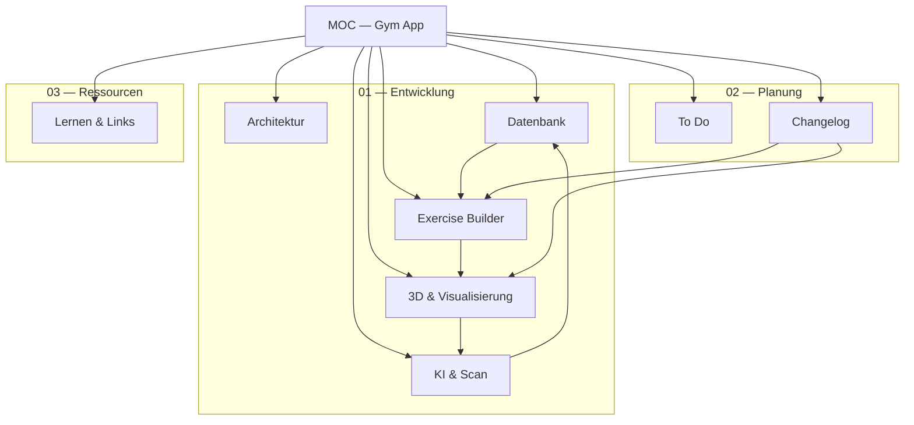

# Gym App — Map of Content

> [!ABSTRACT] Übersicht
> Zentrale Navigationskarte für das gesamte Jarvis-Vault. Die App ist eine React Native / Expo Gym-App mit Exercise Builder, 3D-Menschenmodell, KI-Scan-Features und Supabase-Backend.
>
> **App-Pfad:** `C:\Users\kubis\gym-app`
> **Starten:** `cd "C:\Users\kubis\gym-app"; claude` oder `npx expo start`

---

## 01 — Entwicklung

### Architektur
- [[claude]] — **Master-Übersicht** aller Dateien: Screens, Components, Lib, DB, Assets, Skripte
- [[Claude code]] — CLI-Befehle + stabiler Referenz-Commit (`ab97e26`)
- [[Commands Claude Code]] — Ergänzende Notizen zu Claude Code

### Datenbank

> [!NOTE] Datenpipeline
> `exercise1.xlsx` → CSV → Python-Script → `output.sql` → Supabase

- [[1 gemini]] — Datenstruktur: Name, Superdefault, Kombi, Details-JSONB
- [[2 gemini]] — DB-Hierarchie: Status → Identität → Zuordnung → Merkmale
- [[claude code die Struktur erklären]] — Abfragelogik: Place → Weighttype → Muscle → Exercise → Equipment → Details
- [[supabase+bilder]] — Architektur-Entscheidung: Supabase Pro + Cloudflare R2
- [[excel data to superbase]] — Import-Pipeline: Script ausführen, SQL einspielen

### Exercise Builder
- [[Ausführungen]] — **var-Details System**: welches Detail steuert den Wechsel zwischen Exercise-Varianten
- [[Exercise1]] — Superdefault-Konzept, exercise name, Kombi-Zuordnung
- [[checkliste für Exercises in step3]] — Regeln für Cables used / Hands used in Abkürzung & Anzeige

### 3D & Visualisierung

> [!EXAMPLE] Technologie-Stack
> `Mixamo` → `Blender` → `GLB` → `expo-gl` + `three.js` → `HumanModel3D.tsx`

- [[3D Modell mit blender]] — Vollständige Implementierung: Modell-Setup, Packages, Code, Muskel-Mapping
- [[3D Modell in der App]] — Kamera-Perspektiven (vorne/seite/oben), Muskel-Highlighting
- [[Claude Perspektiven]] — Entscheidungsmatrix: SVG → Pre-rendered → KI → **3D-Modell** ← aktuell
- [[Griffe einscannen]] — 3D-Scanning mit Polycam, Luma AI, RealityScan

### KI & Scan

| Feature | Technik | Ort |
|---|---|---|
| Live-Gewichte | OCR + Regressionsmodell | Lokal |
| Bankwinkel | Hough-Transform + IMU | Lokal |
| Griffe | Metric Learning (ResNet) | Lokal |
| Plan-Import | NLP + Sentence-BERT | Cloud |
| Maschinen | Keypoint + Kinematik | Server |

- [[Plan_1 (Gemini + gpai)]] — Übersicht aller Scan-Techniken
- [[Plan_2 (Gemini + gpai)]] — Detaillierte Implementierung jedes Scan-Moduls
- [[Wegweiser für Cursor]] — Cursor-Implementierungshinweise
- [[Berechnung von der Muskelaktivierung]] — 3 Ansätze: Vektor-Heuristik / OpenSim / Surrogate ML

---

## 02 — Planung

### To Do
- [[To Do's_2]] — Feature-Gaps: KI Meta-Analysen, Builder-Logik, Abkürzungen, Muskel-Hierarchie
- [[To Do's_1]] — Übungen & Ausführungen die noch hinzugefügt werden sollen
- [[29.03.md|29.03]] — TO DOs vom 29.03
- [[TRAAAASH]] — Übungen-Notizen zum Hinzufügen

### Changelog

> [!SUCCESS] Letzter Stand: 02.04.2026

- [[30.03.]] — App-Grundstruktur aufgebaut, 3D-Builder, Auth
- [[31.03.]] — 3D-Builder fixes, Perspektiven-Logik, Dropdown-Flow
- [[02.04.]] — Free+Cable Triceps, Superdefault-Logik, Pose→Muskelaktivierung Plan

---

## 03 — Ressourcen

- [[lernen]] — Offene Fragen: MCPs, Clerk, Stripe, UX, Warp, Supabase-Sicherheit
- [[Youtube videos]] — YouTube-Links, Tool-Alternativen
- [[Icons]] — UI-Terminologie (Chevron, Caret, Expand/Collapse)

---

## Beziehungsgraph

